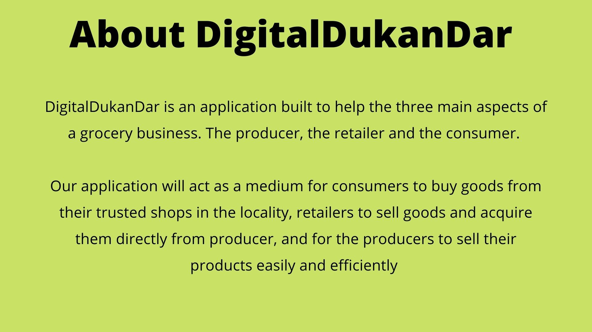
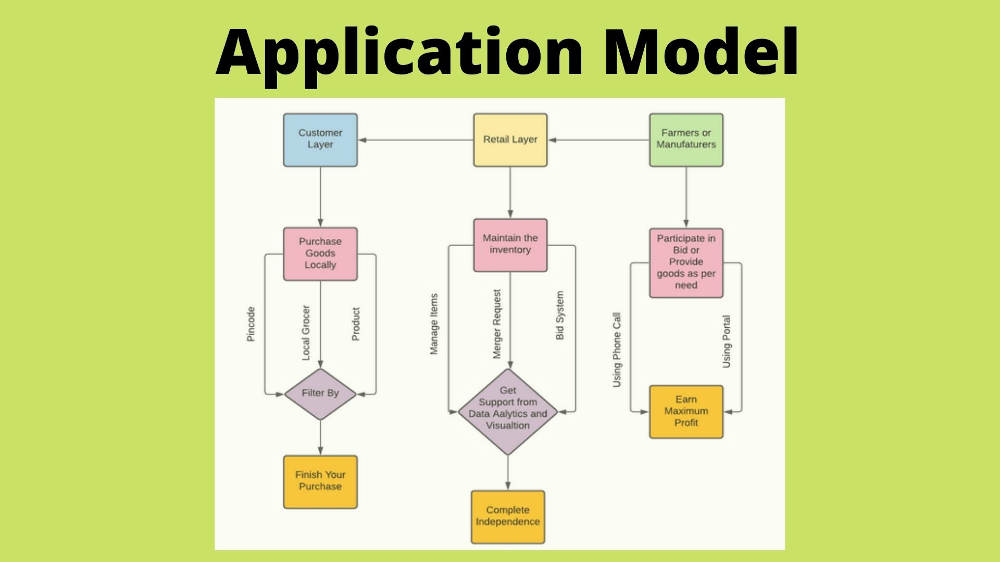

<h1 align="center">DigitalDukaanDaar</h1>
<!-- PROJECT LOGO -->
<br />
<p align="center">
  <a href="https://github.com/anmolag10/1_PacManBytes">
    
  </a>

  

  <p align="center">
  
  
    <br />
    <a href="https://github.com/anmolag10/1_PacManBytes/blob/main/README.md"><strong>Explore the docs »</strong></a>
    <br />
    <br />
    <a href="https://github.com/anmolag10/1_PacManBytes/blob/main/README.md">View Demo</a>
    ·
    <a href="https://github.com/anmolag10/1_PacManBytes/issues">Report Bug</a>
    ·
    <a href="https://github.com/anmolag10/1_PacManBytes/issues">Request Feature</a>
  </p>
</p>

<!-- TABLE OF CONTENTS -->
<details open="open">
  <summary>Table of Contents</summary>
  <ol>
    
      
      <ul>
        <li><a href="#built-with">Built With</a></li>
      </ul>
    </li>
    <li>
      <a href="#getting-started">Getting Started</a>
      <ul>
        <li><a href="#prerequisites">Prerequisites</a></li>
        <li><a href="#installation">Installation</a></li>
      </ul>
    </li>
  </ol>
</details>

<!-- Documentation -->
## Documentation


### Built With
[](https://www.python.org/)
[](https://forthebadge.com)
[](https://forthebadge.com)
[](https://forthebadge.com)

<a href="https://getbootstrap.com/">
    
</a>

<a href="http://www.djangoproject.com/"></a>

* [Bootstrap](https://getbootstrap.com)
* HTML
* CSS
* [Python](https://www.python.org/downloads/)
* [Django](https://www.djangoproject.com/)

<!-- GETTING STARTED -->
## Getting Started

### Prerequisites

1. Fork and Clone
    <ol>
    <li>Fork the Team-Ankuram-maxo Repo</li>
    <li>Clone the repo to you computer.</li>
    </ol>

2. Create a Virtual Environment for the Project

    In Windows
    ```bash
   py -m venv env
    
   .\env\Scripts\activate

    ```

    In Ubuntu/MacOS
    ```bash
    python -m virtualenv venv
    
    source venv/bin/activate
    ```
   
   If you are giving a different name then `venv`, then please mention it in `.gitigonre` first
   
   3. Install all the requirements

    ```bash
    pip install -r requirements.txt
    ```
   
### Installation
   

  4. Checkout to develop branch
       ```git
      git status
      git pull
      git branch
      git checkout develop

  5. Run server
      ```bash
      python manage.py runserver
      ```
 
